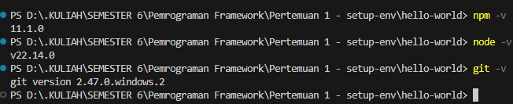
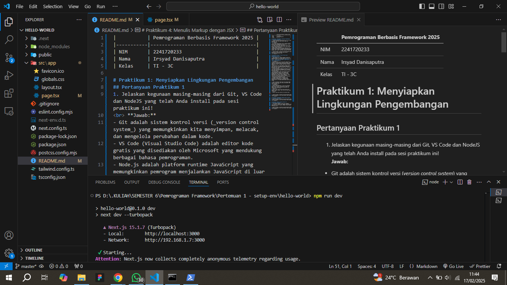
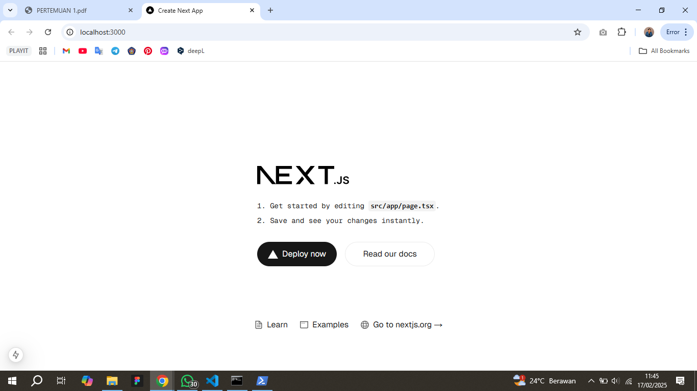
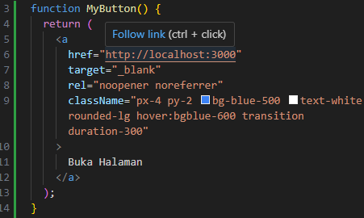
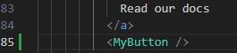
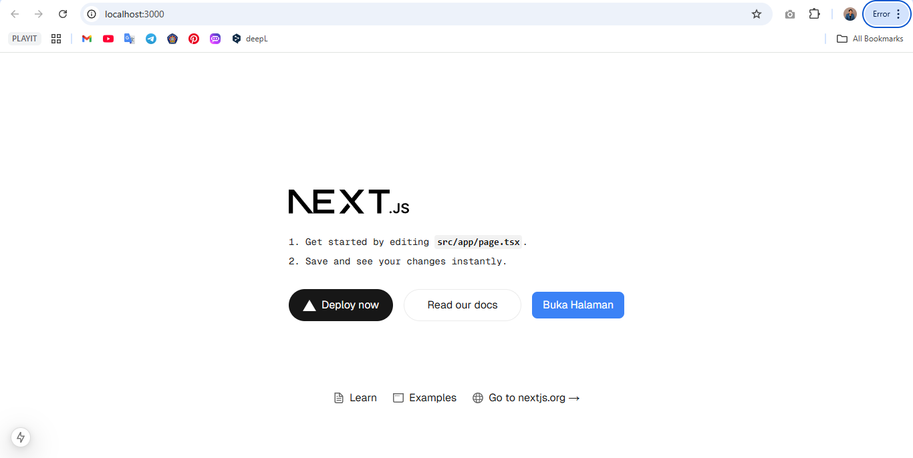
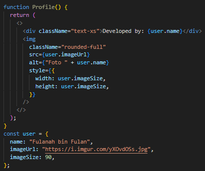
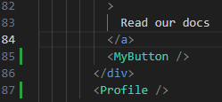
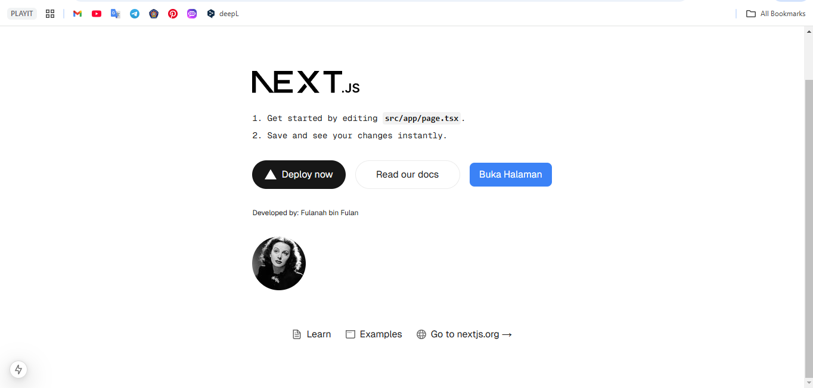

|       | Pemrograman Berbasis Framework 2025 |
| ----- | ----------------------------------- |
| NIM   | 2241720233                          |
| Nama  | Irsyad Danisaputra                  |
| Kelas | TI - 3C                             |

# Praktikum 1: Menyiapkan Lingkungan Pengembangan

## Pertanyaan Praktikum 1

1. Jelaskan kegunaan masing-masing dari Git, VS Code dan NodeJS yang telah Anda install pada sesi praktikum ini!
     **Jawab:**

- Git adalah sistem kontrol versi (_version control system_) yang memungkinkan kita menyimpan, melacak, dan mengelola perubahan dalam kode.
- VS Code (Visual Studio Code) adalah editor kode gratis yang disediakan oleh Microsoft yang mendukung berbagai bahasa pemrograman.
- Node.js adalah platform runtime JavaScript yang memungkinkan pemrogram menjalankan JavaScript di luar browser. Node.js dapat digunakan untuk mengembangkan aplikasi web, server, alat baris perintah, dan skrip.

2. Buktikan dengan screenshoot yang menunjukkan bahwa masing-masing tools tersebut telah berhasil terinstall di perangkat Anda!
     **Jawab:**
   

# Praktikum 2: Membuat Proyek Pertama React Menggunakan Next.js

## Pertanyaan Praktikum 2

1. Pada Langkah ke-2, setelah membuat proyek baru menggunakan Next.js, terdapat beberapa istilah yang muncul. Jelaskan istilah tersebut **TypeScript, ESLint, Tailwind CSS, App Router, Import alias, App router, dan Turbopack!**
     **Jawab:**

- TypeScript adalah versi yang lebih canggih dari JavaScript karena memiliki sistem tipe statis. Dengan TypeScript, kesalahan dalam kode dapat terdeteksi sebelum dijalankan, sehingga lebih aman dan mudah dikelola.
- ESLint adalah alat yang membantu menjaga kualitas kode JavaScript dan TypeScript dengan memberikan peringatan jika terdapat kesalahan atau inkonsistensi dalam penulisan kode.
- Tailwind CSS adalah framework CSS berbasis utility class yang memungkinkan pengembang untuk langsung menerapkan gaya pada elemen HTML tanpa perlu menulis file CSS terpisah.
- App Router adalah sistem routing baru di Next.js yang menggunakan direktori app/ sebagai dasar navigasi aplikasi. Metode ini lebih fleksibel dibandingkan sistem sebelumnya (pages/) karena mendukung fitur seperti server components, layout yang lebih efisien, dan loading UI bawaan.
- Import alias memungkinkan kita untuk menggunakan nama pendek yang lebih mudah diingat.
- Turbopack adalah bundler inkremental yang terintegrasi dengan Next.js. Turbopack dapat digunakan untuk mempercepat pengembangan lokal aplikasi Next.js, terutama dalam proses build dan hot reload.

2. Apa saja kegunaan folder dan file yang ada pada struktur proyek React yang tampil pada gambar pada tahap percobaan ke-3!
     **Jawab:**

- **node_modules/**
   Berisi semua dependensi (library dan package) yang diinstal melalui npm atau yarn. Folder ini dibuat secara otomatis setelah menjalankan npm install atau yarn install.
- **public/**
   Berisi aset statis yang tidak diproses oleh Webpack, seperti gambar, ikon, atau file HTML utama (index.html).
- **src/**
   Berisi semua kode sumber dari aplikasi React.

3. Buktikan dengan screenshoot yang menunjukkan bahwa tahapan percobaan di atas telah berhasil Anda lakukan!
     **Jawab:**
   
   

# Praktikum 3: Menambahkan Komponen React (Button)

## Pertanyaan Praktikum 3

1. Buktikan dengan screenshoot yang menunjukkan bahwa tahapan percobaan di atas telah berhasil Anda lakukan!
     **Jawab:**
     membuat fungsi MyButton()
   
     memanggil fungsi MyButton()
   
     terdapat button Buka Halaman bewarna biru
   

# Praktikum 4: Menulis Markup dengan JSX

## Pertanyaan Praktikum 4

1. Untuk apakah kegunaan sintaks user.imageUrl?
     **Jawab:** Sintaks user.imageUrl digunakan untuk mengakses nilai dari properti imageUrl yang terdapat dalam objek user.

2. Buktikan dengan screenshoot yang menunjukkan bahwa tahapan percobaan di atas telah berhasil Anda lakukan!
     **Jawab:**
     Membuat fungsi Profile()
   
     Memanggil fungsi Profile()
   
     Terdapat profil dan keterangan developed by
   
