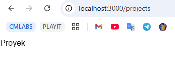

|       | Pemrograman Berbasis Framework 2025 |
| ----- | ----------------------------------- |
| NIM   | 2241720233                          |
| Nama  | Irsyad Danisaputra                  |
| Kelas | TI - 3C                             |

# Jobsheet Week 4

## Langkah-langkah Praktikum

### 1. Persiapan Lingkungan

1. Pastikan Node.js dan npm sudah terinstal di komputer Anda. Anda dapat memeriksanya dengan
   menjalankan perintah berikut di terminal atau command prompt:
   node -v
   npm -v
2. Buat direktori baru untuk proyek Next.js Anda:
   mkdir website-pribadi
   cd website-pribadi
3. Inisialisasi proyek Next.js dengan TypeScript dan App Router:
   npx create-next-app@latest . --typescript –app
4. Cek konfigurasi postcss.config.mjs:
5. Cek di app/globals.css, sudah ada import untuk tailwindcss:
6. Buka app/layout.tsx, tambahkan import './globals.css', dan modifikasi menjadi sebagai berikut:
7. Jalankan aplikasi Next.js:
   npm run dev
   Aplikasi akan terbuka di browser pada alamat hƩp://localhost:3000.

### 2. Membuat Halaman Website

Website pribadi akan memiliki tiga halaman:
   Tentang Saya: Halaman berisi profil singkat dan link ke media sosial.
   Proyek: Halaman untuk menampilkan proyek-proyek yang telah diselesaikan.
   Esai: Halaman untuk menampilkan daftar artikel yang telah ditulis.
Langkah-langkah:

1. Buat file app/page.tsx sebagai halaman "Tentang Saya":
2. Buat file app/projects/page.tsx sebagai halaman "Proyek":
3. Buat file app/essays/page.tsx sebagai halaman "Esai":
4. Buka browser dan akses:
     o http://localhost:3000/ untuk halaman "Tentang Saya".
     o http://localhost:3000/projects untuk halaman "Proyek".
     o http://localhost:3000/essays untuk halaman "Esai".

### Praktikum 3: Membuat Layout dan Navigasi

1. Buat direktori src/components jika belum ada. Lalu buat file src/components/Layout.tsx:

2. Buat file src/components/Navbar.tsx

3. Buat file src/components/Footer.tsx

4. Update file app/layout.tsx untuk menggunakan layout:

5. Update setiap halaman menambahkan metadata dengan generateMetadata:

6. Lakukan hal yang sama untuk halaman projects/page.tsx dan essays/page.tsx.

### Praktikum 4: Membuat Halaman Proyek dengan Grid Responsif

1. Buat folder di public/images. Kemudian tambahkan dua image, lalu rename dengan nama project1.png dan project2.png

2. Modifikasi file app/projects/page.tsx:

3. Simpan file dan buka http://localhost:3000/projects di browser. Anda akan melihat da ar proyek dalam grid yang responsif.
