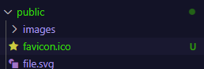
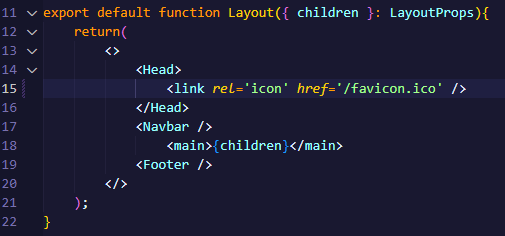
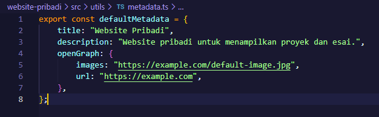
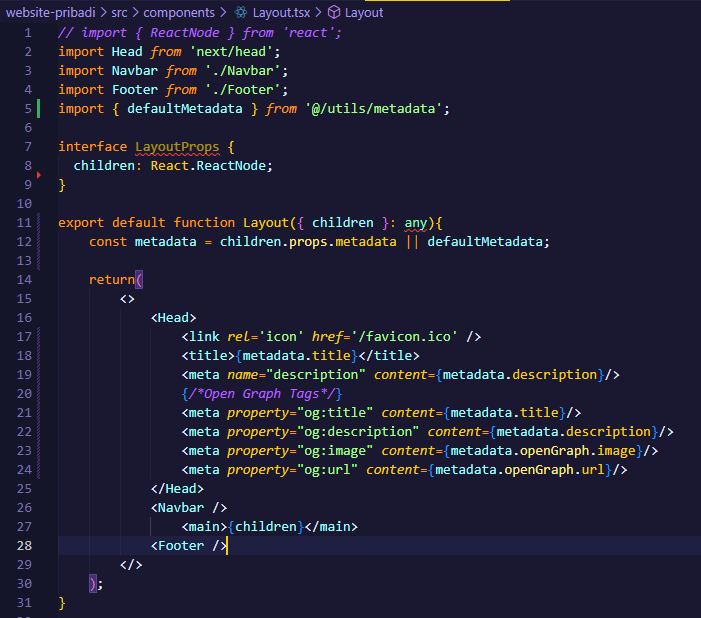
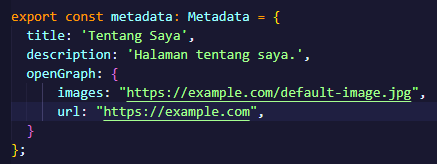
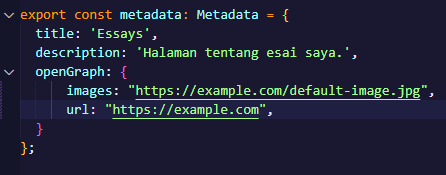
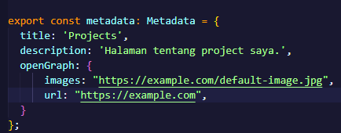
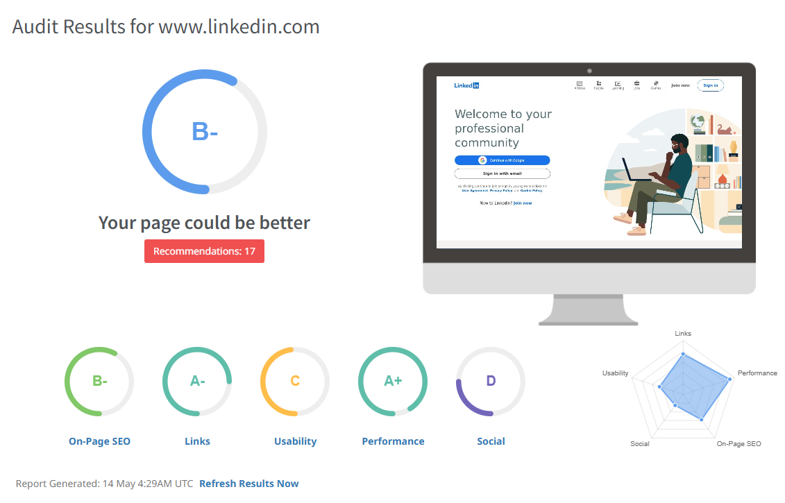

|       | Pemrograman Berbasis Framework 2025 |
| ----- | ----------------------------------- |
| NIM   | 2241720233                          |
| Nama  | Irsyad Danisaputra                  |
| Kelas | TI - 3C                             |

# Jobsheet Week 5

### Praktikum 1: Menambahkan Favicon

1. Siapkan file favicon (format .ico) dan letakkan di folder public/.

2. Hapus faveicon.ico yang ada di folder src/app dan Update file src/components/layout.tsx untuk menambahkan favicon:

3. Simpan dan jalankan proyek. Favicon akan muncul di tab browser.

### Praktikum 2: Menambahkan Metadata untuk SEO

1. Buat file src/utils/metadata.ts untuk menyimpan metadata default:

2. Update file src/components/layout.tsx untuk menggunakan metadata default jika tidak ada metadata yang di-pass:

3. Update Setiap Halaman untuk dapat mem-pass definisi metadata

4. Lanjutkan untuk halaman Proyek dan Esai

### Praktikum 3: Menguji SEO

1. Setelah menambahkan metadata, favicon, dan Open Graph Tags, Anda dapat menguji SEO dengan Membuka halaman di browser dan memeriksa elemen HTML menggunakan Developer Tools (Ctrl + Shift + I atau F12).

### Tugas

1. Gunakan tools seperti Google Search Console untuk memeriksa performa SEO dari suatu website.

