|       | Pemrograman Berbasis Framework 2025 |
| ----- | ----------------------------------- |
| NIM   | 2241720233                          |
| Nama  | Irsyad Danisaputra                  |
| Kelas | TI - 3C                             |

# Jobsheet Week 6

### Praktikum 1: Preparation

1. npx create-next-app@15.2.1 state-management-praktikum

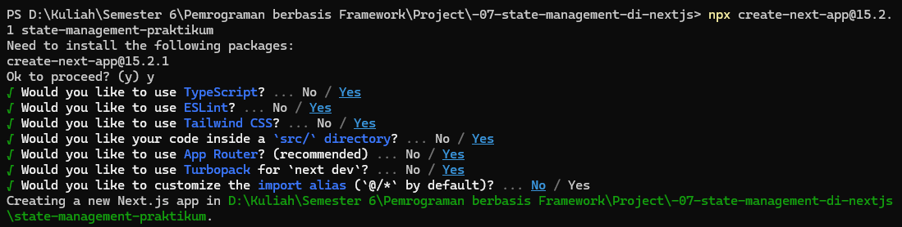

2. npm install zustand @reduxjs/toolkit react-redux next-redux-wrapper swr

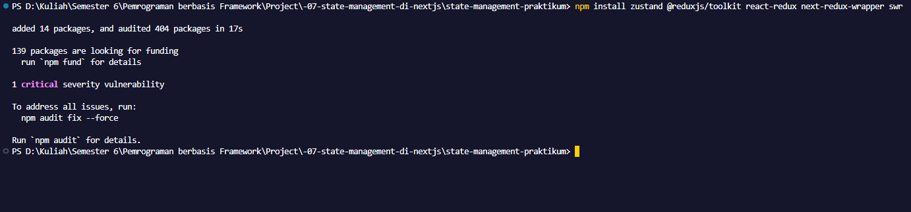

### Praktikum 2: React Context untuk State Global Sederhana

1. Buat Context

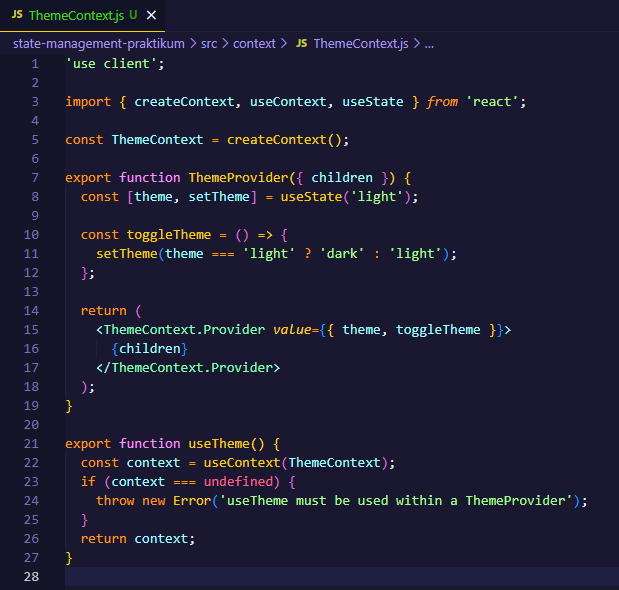

2. Implementasi di Komponen

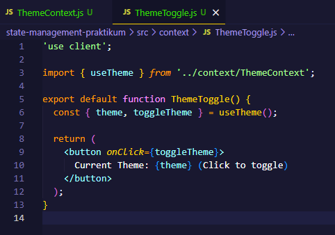

3. Wrap Aplikasi

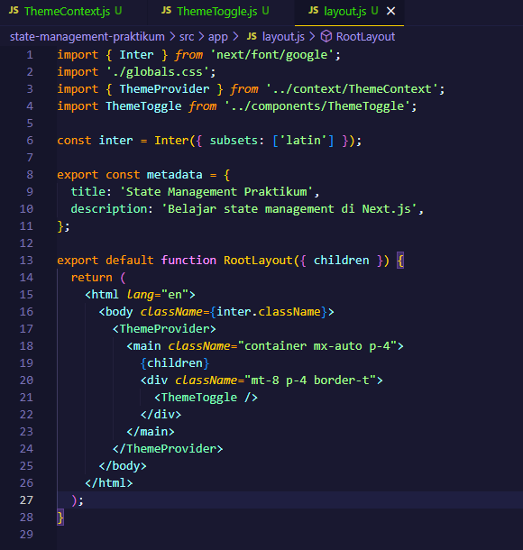

### Praktikum 3: Zustand untuk State Management Kompleks

1. Buat Store

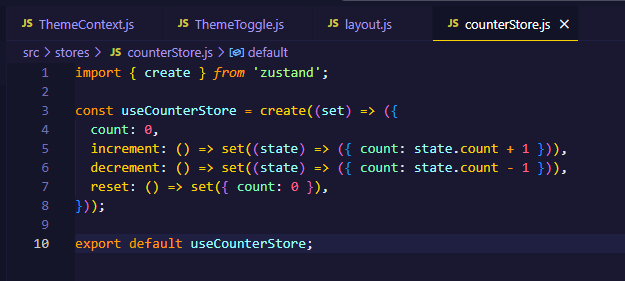

2. Implementasi Komponen

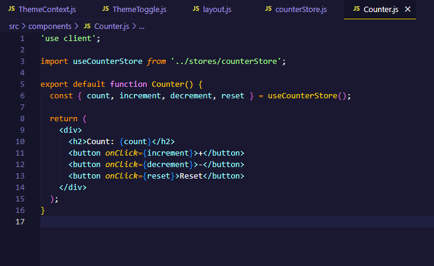

3. Gunakan Komponen dalam halaman

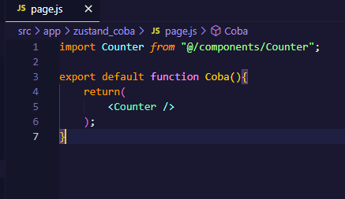

### Praktikum 4: Redux Toolkit dengan SSR Support

1. Setup Redux

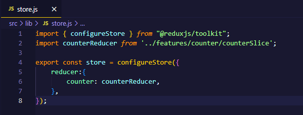

2. Buat Slice

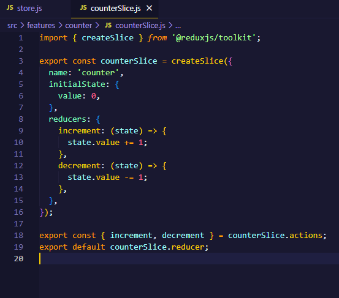

3. Provider Setup

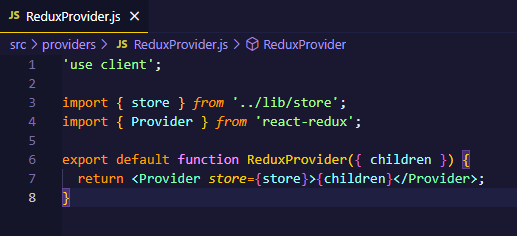

4. Implementasi Komponen

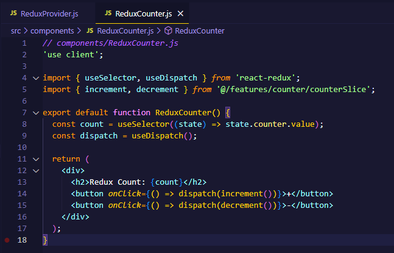

5. Gunakan Komponen dalam halaman

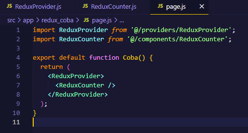

### Praktikum 5: Data Fetching dengan SWR

1. Implementasi Data Fetching

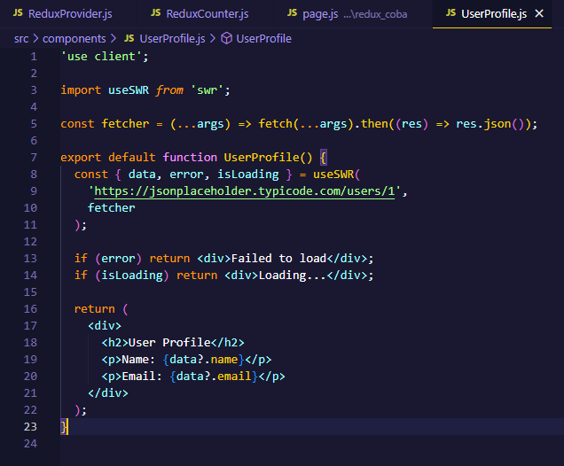

2. Gunakan Komponen dalam halaman

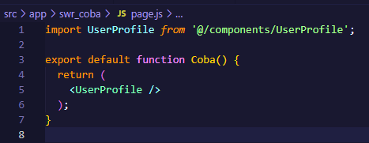

### Praktikum 6: URL State Management

1. Implementasi URL State

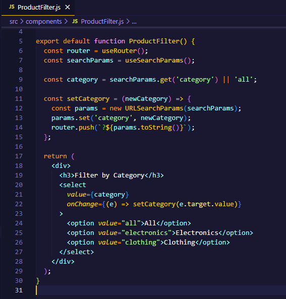

2. Gunakan Komponen dalam halaman

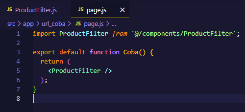

### Tugas

1. Bandingkan performa antara Context API, Zustand, dan Redux

   - Context API

     - Merupakan fitur bawaan React tanpa perlu menambahkan library lain.
     - Ideal untuk mengelola state global yang sederhana seperti tema, bahasa, atau status login.
     - Kurang optimal untuk state yang sering berubah karena dapat menyebabkan seluruh komponen yang menggunakan context ikut re-render.
     - Tidak menyediakan alat pengembangan (DevTools) secara default.
     - Kurang cocok untuk proyek dengan skala besar atau yang kompleks.
     - Lebih tepat digunakan pada proyek kecil hingga menengah dengan kebutuhan yang tidak rumit.

   - Zustand

     - Library yang ringan dan tidak membutuhkan penyedia (provider).
     - Mengoptimalkan proses re-render dengan hanya memperbarui komponen yang menggunakan state terkait.
     - Mendukung operasi asynchronous secara native.
     - Bisa digunakan di dalam maupun luar komponen React.
     - Cocok untuk proyek menengah hingga besar yang ingin tetap sederhana.
     - Mudah dipelajari dan digunakan.
     - Mendukung middleware, persistence, dan DevTools.

   - Redux (dengan Redux Toolkit)
     - Sangat sesuai untuk proyek berskala besar dan yang memiliki tingkat kompleksitas tinggi.
     - Menyediakan DevTools lengkap dengan kemampuan logging dan time-travel debugging.
     - Mendukung middleware seperti redux-thunk atau redux-saga untuk penanganan aksi asynchronous.
     - Boilerplate awal banyak, tapi bisa disederhanakan dengan Redux Toolkit.
     - Struktur kode lebih ketat dan terorganisir.
     - Cocok untuk tim besar yang memerlukan standar dan dokumentasi jelas.

2. Diskusikan kapan sebaiknya menggunakan masing-masing solusi

   - Context API: Pilihan terbaik untuk aplikasi kecil dengan kebutuhan state yang sederhana.
   - Zustand: Cocok bila menginginkan performa optimal dengan konfigurasi yang ringan dan mudah.
   - Redux: Direkomendasikan untuk aplikasi besar yang kompleks dan membutuhkan kontrol mendalam atas state.
